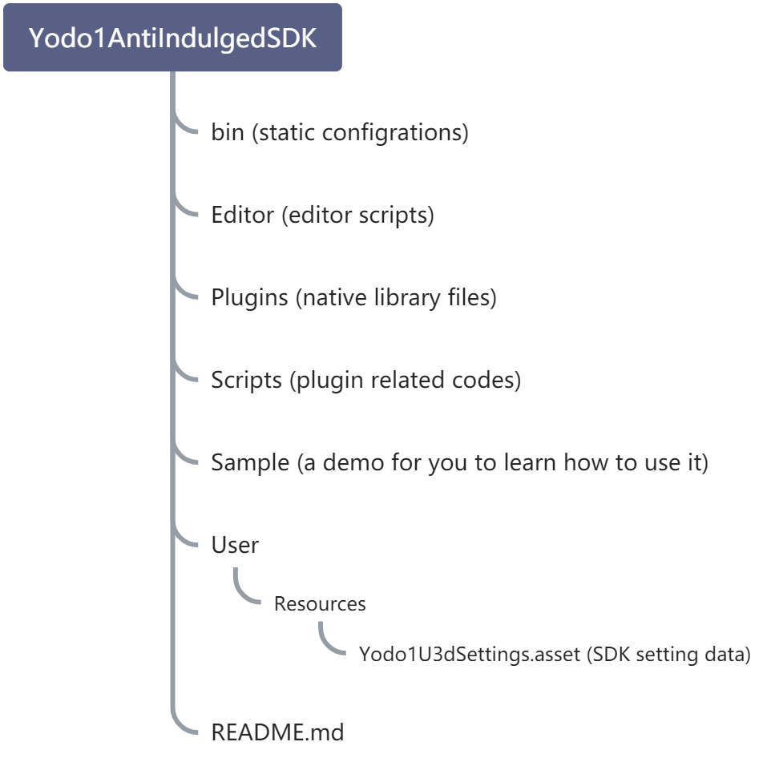
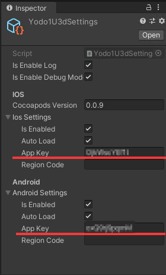

# Anti-addiction 2.0 integration manual

## ****Plug-in introduction****
At present, all of the developers who want to enter the China mobile market to release games have to abide by the relevant policies of the Chinese government on the protection of minors:

In order to protect the physical and mental health of minors, users under the age of 18 will be restricted by the anti-addiction system. When users become adults, the anti-addiction restriction strategy will be lifted (restriction strategies can be different in each specific game categories. Please be subject to the actual trigger in the game).

Therefore, we have made interfaces and plug-ins for the core requirements of the corresponding national policies, so that any user who uses the Yodo1 anti-addiction SDK can easily access the anti-addiction functions and passed the Chinese store review.

After the game is integrated with our SDK, be sure to implement the following core functions:

- Real name authentication
- Game play time limit
- Game payment limit

<br />
<br />


## ****Integration Guide****
We have made plug-in packages on various platforms for all kinds of developers:


- Unity Plugin
- Android Lib
- iOS Lib


### Unity Plugin
**Current version:**
<br />
0.9.2<br />

**Cocoapods version:**
<br />
2.0.2<br />


**Supports Unity 3D:**
- 2017.4.40c 
- 2018.4.27f1 
- 2019.4.12f1

and newer versions


**Download plugin:**
<br />
Copy this code below and paste into commandline to get the latest build `0.9.2`
```bash
curl -L "https://yodo1-generic.pkg.coding.net/anti-indulged-system-SDK/unity-plugin/Yodo1AntiAddictionSDK?version=0.9.2" -o Yodo1AntiAddictionSDK-0.9.2.unitypackage
```


#### **Access instructions:**
Plug-in structure

<br />
Download the Unity plug-in package and Import it to the current project :

Please apply for the application ID and key in MAS background, and you will get the unique AppKey of the application.
 
Enter the AppKey in the SDK configuration object (the AppKey of the application can be found in the background of the application).
 
Configuration object path Please reference plug-in structure diagram:
```
Yodo1AntiAddictionSDK/User/Resources/Yodo1U3dSettings.asset
```



#### SDK initialization
After accessing the plug-in, call the relevant code in the function of object 'Awake' during project initialization:
```csharp
/// <summary>
/// Return initialization result callback.
/// </summary>
/// <param name="result">
///    <see value="true">Initialization successful.</see>
///    <see value="false">Initialization failed.</see>
/// </param>
/// <param name="content">Information content when initialization fails.</param>
public delegate void InitDelegate(bool result, string content);


private void Awake()
{
    // Set SDK initialization callback.
    Yodo1U3dAntiAddiction.SetInitCallBack((bool result, string content) =>
    {
        if (result)
        {
            // Initialization successful.
            // TODO do the success flow and game begin.
        }
        else
        {
             // Initialization failed.
             // TODO do the fail flow, e.g. show the popup message to user. 
        }
        Debug.LogFormat("result = {0}, content = {1}", result, content);
    });
}
    
```


#### Real name authentication
When the game starts, a "enter the game" button should be set. After clicking, a real-name verification window will pop up. Users have to enter the citizen ID and relevant information of the People's Republic of China.
 
Users can enter the game and begin to experience the game content only after passing the verification.
```csharp
public void OnClickStartGameButton()
{
    // real name authentication.
    Yodo1U3dAntiAddiction.VerifyCertificationInfo(accountIdInputFiled.text, (Yodo1U3dEventAction eventAction) => {
        Debug.LogFormat("action = {0}", eventAction);
        bool isGuestUser = false;
        if (eventAction == Yodo1U3dEventAction.ResumeGame)
        {
            //Guest mode or a successful real name authentication will enable you to resume playing the game.

            //Check whether it is a guest.
            isGuestUser = Yodo1U3dAntiAddiction.IsGuestUser();
            Debug.LogFormat("IsGuestUser = {0}", Yodo1U3dAntiAddiction.IsGuestUser());
        }
        else if(eventAction == Yodo1U3dEventAction.EndGame)
        {
            //Real name authentication failure prompt and exit the game(实名认证失败提示并退出游戏).
            Dialog.ShowMsgDialog("Warm prompt", "Real name authentication failed!", true, () => {
                Application.Quit();
            });

        }
    });
}
```


#### Play time limit
Minor players will receive a warning after the total play time accumulates to a certain period of time. When the play time exceeds the limit, they will not be able to enter the game.
 
This function may require developers to modify certain game logic to implement corresponding scenarios. For example, a start screen with "enter the game" button should be added to the game, instead of directly entering the level after the game launched.


```csharp
/// <summary>
/// Callback triggered when the game is notified of the remaining time(对游戏进行剩余时间通知时触发的回调).
/// </summary>
/// <param name="eventAction"> 
///    <see value="ResumeGame">Continue game(继续游戏).</see>
///    <see value="ResumeGame">End game(结束游戏).</see>
/// </param> 
/// <param name="eventCode">
///    <see value="11001">Notification of playing time - minors(对于已玩时间的通知-未成年人).</see>
///    <see value="12001">Notice of no play period - minors(对于禁玩时段的通知-未成年人).</see>
///    <see value="11011">Notification of played time - visitors(对于已玩时间的通知-游客).</see>
///    <see value="12011">Notice of no play period - visitors(对于禁玩时段的通知-游客).</see>
///    <see value="50005">Events generated by third party channel SDK(第三方渠道SDK产生的事件).</see>
/// </param>
/// <param name="title">Notice title of game display(游戏展示的通知标题).</param>
/// <param name="content">Notice content of game display(游戏展示的通知内容).</param>
public delegate void TimeLimitNotifyDelegate(Yodo1U3dEventAction eventAction, int eventCode, string title, string content);


/// <summary>
/// Set remaining time notification callback(设置剩余时间通知回调).
/// </summary>
/// <param name="timeLimitNotifyCallBack">Remaining time notification callback(剩余时间通知回调).</param>
Yodo1U3dAntiAddiction.SetTimeLimitNotifyCallBack((Yodo1U3dEventAction action, string title, string content) =>
{
    Debug.LogFormat("action = {0}, title = {1}, content = {2}", action, title, content);
    if(action == Yodo1U3dEventAction.ResumeGame)
    {
        // Prompt when 10 minutes remain.
        // TODO Warning user it's few time left for playing. 
    }
    else if (action == Yodo1U3dEventAction.EndGame)
    {
        // The game handles the pop-up prompt to exit the game(游戏处理退出游戏的弹框提示).
        // TODO Get time limit event, user can't play game util next day. 
        Dialog.ShowMsgDialog(title, content, true, ()=> {
            Application.Quit();
        });
    }
});
```


Game payment amount limit
Due to restrictions, minor users will not be able to continuously  purchase in-game items when the payment amount in the game reaches a certain limit.
 
In this case, developers need to determine whether the user has been restricted from payment before calling the payment interface.
 
At the same time, developers have to call the SDK's amount reporting interface to record the user's cumulative payment amount during each payment.


#### Check limits
```csharp
/// <summary>
/// Whether the callback of consumption has been restricted(是否已限制消费的回调).
/// </summary>
/// <param name="isAllow">
///    <see value="true">Available for purchase(可购买).</see>
///    <see value="false">Not available for purchase(不可购买).</see>
/// </param>
/// <param name="content">Notice content that needs to be displayed in the game when it is not available for purchase(不可购买时的需要游戏展示的通知内容).</param>
public delegate void VerifyPurchaseDelegate(bool isAllow, string content);

 //please use the RMB fen interface, if the price unit is RMB fen.
/// <summary>
/// Verify whether consumption is restricted, using cent RMB interface.
/// </summary>
/// <param name="priceCent">The price of the commodity, in cent(商品的价格，单位为分).</param>
/// <param name="currency">Corresponding currency symbol(对应货币符号，从产品信息里取).</param>
Yodo1U3dAntiAddiction.VerifyPurchase(priceCent, currency,  (bool isAllow, string context) => {
    Debug.LogFormat("hasLimit = {0}, context = {1}", isAllow, context);
    if (isAllow)
    {
        //can be purchased, execute the purchase process.
        Purchase("com.yodo1.stampede.offer1", price, currency);
    }
    else
    {
        //Can't buy prompt player(不可以购买并提示玩家).
        Dialog.ShowMsgDialog("Warm prompt(温馨提示)", content);
    }
});

//please use the RMB yuan interface, if the price unit is RMB yuan
/// <summary>
/// Verify whether consumption is restricted. RMB yuan interface.
/// </summary>
/// <param name="priceYuan">The price of the commodity, in yuan(商品的价格，单位为元).</param>
/// <param name="currency">Corresponding currency symbol(对应货币符号,商品信息里获得).</param>
public static void VerifyPurchaseYuan(priceYuan, currency,  (bool isAllow, string context) => {
    Debug.LogFormat("hasLimit = {0}, context = {1}", isAllow, context);
    if (isAllow)
    {
        //can be purchased, execute the purchase process.
        Purchase("com.yodo1.stampede.offer1", price, currency);
    }
    else
    {
        //cannot be purchased and prompt the player.
        Dialog.ShowMsgDialog("Warm prompt(温馨提示)", content);
    }
})
```


#### Report consumption information
```csharp
/// <summary>
/// Submit the product info to SDK when game purchase has been success.
/// </summary>
void OnPurchaseSuccess(ProductInfo info)
{
    string productId = info.productId;  // com.yodo1.sample.item1
    //Price. Unit is RMB yuan
    double priceYuan = (double)info.price * 0.01;  // 6.99
    
    //Price. Unit is RMB fen
    double priceCent = info.price;
    string currency = info.currency;   // CNY
    string orderId = info.orderId; // 1000000345744346
    // After purchase has been success.
    // It should pass the actual product information to the SDK to record the cumulative amount paid by users.
    //Please use the RMB fen interface, if the price unit is RMB fen.
    Yodo1U3dAntiAddiction.ReportProductReceipt(productId, Yodo1U3dProductType.Consumables, priceCent, currency, orderId);
    //Please use the RMB yuan interface, if the price unit is RMB yuan.
    Yodo1U3dAntiAddiction.ReportProductReceiptYuan(productId, Yodo1U3dProductType.Consumables, priceYuan, currency, orderId);
}
```


### Android Plugin
**Current version:**
2.0.7

#### Access description
If the game has been connected to the anti-addiction service of Yodo1SDK before, remove it first. Specifically, remove all codes that use the Yodo1ImpubicProtect interface class.
 
#### Project configuration
If your game does not need  access to any other Yodo1 SDK and  Yodo1 package service, you need to add the following tags to the AndroidManifest.xml of the game project:
```xml
<!-- The name value is fixed, and the value changes with the channel to be released (please contact the operation personnel for the specific value). -->
<meta-data
  android:name="Yodo1ChannelCode"
  android:value="Yodo1"
  tools:replace="android:value" />
```


#### Anti-addiction SDK initialization (mandatory)

The game needs to initialize anti-addiction in ‘Activity onCreate’. Please note that initialization is asynchronous. Make sure to call other anti-addiction interfaces after the onInitFinish() callback method in Yodo1AntiAddictionListener is triggered, otherwise, an exception occurs.
 
The Appkey used in the parameter is issued when the game is registered in the background of yodo1. Please contact the operator for details.
```java
/*
  parameter 1：Activity entity
  parameter 2：Appkey issued by Yodo1
  parameter 3：Receives the listener for the anti-addiction system callback
*/
Yodo1AntiAddiction.init(activity, appkey, new Yodo1AntiAddictionListener() {
    /**
        * This callback method is triggered when initialization is complete, and the game needs to wait until this method returns successfully before operating the other anti-addiction interfaces
        * @param result: success or failure
        * @param message:  error information
        */
    @Override
    public void onInitFinish(boolean result, String message) {
        YLog.i(TAG + "onInitFinish, result = " + result + ", message = " + message);
        isInit = result;
    }

    /**
        * This callback is used to inform the game when the player is running short of time.
        * @param event   notification entity
        * @param title   Notification titles that require game to display
        * @param content Notification contents that require game to display
        */
    @Override
    public void onTimeLimitNotify(Yodo1AntiAddictionEvent event, String title, String content) {
        YLog.i(TAG + "onTimeLimitNotify, eventCode = " + event.getEventCode() + ", action = " + event.getAction().toString() + ", title = " + title + ", content = " + content);
        Toast.makeText(MainActivity.this, content, Toast.LENGTH_LONG).show();
        // When the value of action is EndGame, end the game. When it is ResumeGame, the player will only be reminded of the coming time, and then the game will continue.
        if (event.getAction() == Yodo1AntiAddictionEvent.EventAction.EndGame) {
            YLog.e(TAG + "onTimeLimitNotify, 游戏结束");
        } else {
            YLog.i(TAG + "onTimeLimitNotify, 只提醒玩家即将到时，游戏继续运行");
        }
    }
});

```


#### Real name authentication (mandatory)
After the player logs in, the game needs to call the real-name verification interface to ensure that the player passes the real-name verification before entering the game.
 
The accountID used in the real-name verification interface is generated by the game itself. You can also access the account system of Yodo1SDK and use the account returned after you log on to yodo1.
If the game does not have the account function, you can also use the device number as a temporary replacement.
 
Players must have a network connection before they can pass the real-name verification. Without network connection, players can only play for a short time through the trial entrance.
```java
/*
  parameter 1：the currently running activity
  parameter 2：Account ID generated by game or third-party account system. If the game does not have an account system, it can be replaced by the device number.。
*/
Yodo1AntiAddiction.verifyCertificationInfo(activity, accountId, new Yodo1CertificationCallback() {
        @Override
        public void onResult(Yodo1AntiAddictionEvent.EventAction action) {
        YLog.i(TAG + "verifyCertificationInfo callback, action = " + action.name());
        if (action == Yodo1AntiAddictionEvent.EventAction.EndGame) {
        isCertification = false;
        MainActivity.this.finish();
        } else {
        isCertification = true;
        Toast.makeText(MainActivity.this, "实名完毕，继续游戏。", Toast.LENGTH_LONG).show();
        }
        changeView();
        }
    });
```


#### Play time limit (mandatory)

After a player passes real-name verification and is authenticated as a minor (or enters the game through the trial button),Yodo1 anti-addiction system will limit the player's play time.
This function is automatically run by Yodo1 anti-addiction SDK, and no additional access is required.
The developer only needs to pay attention to the onTimeLimitNotify callback method in the Yodo1AntiAddictionListener listener passed in during initialization. The SDK uses this method to inform the developer what to do.
This method is described as follows:
```java
/**
  * Function that is triggered when the game is notified of the amount of time remaining
  *
  * When the game receives a callback, a dialog box will pop up to inform the player（Please use the title and content returned by the callback to display the contents of the dialog），
  * After the player has confirmed the content of the dialog box, the value of getAction() is used to carry out subsequent actions (end or resume the game).
  *
  * @param event   Notification entity
  * @param title   Notification titles that require game to display
  * @param content Notification contents that require game presentation
  */
void onTimeLimitNotify(Yodo1AntiAddictionEvent event, String title, String content);

class Yodo1AntiAddictionEvent {
    // After receiving the notification, the developer determines the action to be taken through getAction(). ResumeGame means continuing the game, and EndGame means ending the game
    EventAction getAction();
    //  (optional)Developers can determine what event has triggered the current notification with getEventCode(). See the parameters below:
    int getEventCode();
}

public static class EventCode {
    /**
    * Notification for a minor that he is about to or has reached today's time limit
    */
    public static final int EVENT_NOTIFY_MINOR_PLAYED_TIME = 11001;
    /**
    * Notification for a minor that he is about to or has reached today's playtime ban
    */
    public static final int EVENT_NOTIFY_MINOR_FORBIDDEN_TIME = 12001;
    /**
    * Notification for a guest that he is about to or has reached today's time limit
    */
    public static final int EVENT_NOTIFY_GUEST_PLAYED_TIME = 11011;
    /**
    *  Notification for a guest that he is about to or has reached today's playtime ban
    */
    public static final int EVENT_NOTIFY_GUEST_FORBIDDEN_TIME = 12011;
    /**
    * Events generated by the third-party channel SDK
    */
    public static final int EVENT_NOTIFY_THIRD_CHANNEL_UNKNOW_EVENT = 50005;
}
```


#### Payment amount restrictions and Reporting (mandatory)

When a player makes a purchase, the developer needs to call the payment interface to determine whether the player has reached the upper limit of the payment amount.
```java
/*
  Parameter 1: The price of the item the player wants to buy,玩家要购买的商品价格，单位为分
  Parameter 2: Currency, set as "; CNY"
*/
Yodo1AntiAddiction.verifyPurchase(price, currency, new Yodo1VerifyPurchaseCallback() {
        @Override
        public void onResult(boolean isAllow, String message) {
        YLog.d(TAG + "purchase , isAllow = " + isAllow + ", message = " + message);
        if (isAllow) {
            // Allow the purchase, pls proceed to buy 
        }
});
```
Finally, after the purchase is successful and the product has been distributed to the player, developer needs to call the reporting interface to notify the SDK to record the player's expenses this time:
```java
/*
  orderId: 订单号。如果接入Yodo1支付系统则由支付回调返回，否则由游戏自己产生。
  itemCode: 商品编号
  itemType: 商品类型，见下方
  price: 商品价格，单位为分
  
*/
Yodo1ProductReceipt receipt = new Yodo1ProductReceipt(
        orderId,
        itemCode,
        itemType,
        price,
        currency);
Yodo1AntiAddiction.reportProductReceipt(receipt);


public enum ItemType {
        NonConsumables("非消耗品", 0),
        Consumables("消耗品", 1), 
        AutoSubscription("订阅商品", 2);
} 
```


---

### iOS Plugin
 
#### Access description
If the game has been connected to the anti-addiction service of Yodo1SDK before, remove it first. Specifically, remove all code that uses the Yodo1RealNameManager interface class.


#### Project configuration
Anti-addiction 2.0 is integrated with cocoapods. The version is 2.0.0.1. The profile example is as follows:
```ruby
platform :ios, '9.0'
source 'https://github.com/Yodo1Sdk/Yodo1Spec.git'
source 'https://github.com/CocoaPods/Specs.git'
target 'yodo1-anti-indulged-ios' do
    pod 'Yodo1AntiAddiction', '2.0.0.1'
end

```


#### Anti-addiction SDK initialization (mandatory)

The game needs to be in Perform anti-addiction initialization in the didFinishLaunchingWithOptions method. Note that initialization is asynchronous. Wait until the onInitFinish callback method in Yodo1AntiAddictionDelegate is triggered before calling other anti-addiction interfaces. Otherwise, an exception will occur.
 
The Appkey used in the parameter is issued when the game is registered in the background of yodo1. Please contact the operator for details.
```objectivec
/*
  Parameter 1：Appkey issued by Yodo1
  Parameter 2：Delegate that receives the callback from the anti-addiction system 
*/
- (void)init:(NSString *)appKey delegate: (id<Yodo1AntiAddictionDelegate>)delegate;

#pragma mark - Yodo1AntiAddictionDelegate
- (void)onInitFinish:(BOOL)result message:(NSString *)message {
}

- (BOOL)onTimeLimitNotify:(Yodo1AntiAddictionEvent *)event title:(NSString *)title message:(NSString *)message {
    NSLog(@"游戏通知 - %@", message);
    return NO;
}
```


#### Real name verification (mandatory)
After the player logs in, the game needs to call the real-name verification interface to ensure that the player passes the real-name verification before entering the game.
The accountID used in the real-name verification interface is generated by the game itself. You can also access the account system of Yodo1SDK and use the account returned after you log on to yodo1.
If the game does not have the account function, you can also enter the device number as a temporary replacement.
Players must have a network connection before they can pass the real-name verification. Without network connection, players can only play for a short time through the trial entrance.
```objectivec
/// Verify the player's real name information
/// player's accountId 
/// successful real-name authentication callbacks 
/// failed real-name authentication callbacks 
- (void)verifyCertificationInfo:(NSString *)accountId success:(Yodo1AntiAddictionSuccessful)success failure:(Yodo1AntiAddictionFailure)failure;

#pragma mark - Yodo1AntiAddictionSuccessful
typedef BOOL (^Yodo1AntiAddictionSuccessful)(id _Nullable);

#pragma mark - Yodo1AntiAddictionFailure
typedef BOOL (^Yodo1AntiAddictionFailure)(NSError * _Nonnull);
```


#### Play time limit (mandatory)
After a player passes real-name verification and is authenticated as a minor (or enters the game through the trial button),Yodo1 anti-addiction system will limit the player's play time.
This function is automatically run by Yodo1 anti-addiction SDK, and no additional access is required.
The developer only needs to pay attention to the onTimeLimitNotify callback method in the Yodo1AntiAddictionDelegate agent passed in during initialization. The SDK uses this method to inform the developer what to do.
This method is described as follows:
```objectivec
/// Verify the player's real name information
/// When the game receives a callback, a dialog box will pop up to inform the player(Please use the title and message returned by the callback to display the dialog). After the player confirms the content of the dialog box, the value of event.action is used to carry out subsequent actions（end or resume the game）
/// notification entity that games needs to display  
/// notification title  that games needs to display
/// notification content that games needs to display
- (BOOL)onTimeLimitNotify:(Yodo1AntiAddictionEvent *)event title:(NSString *)title message:(NSString *)message;

#pragma mark - Yodo1AntiAddictionEvent
@interface Yodo1AntiAddictionEvent : NSObject
@property (nonatomic, assign) Yodo1AntiAddictionEventCode eventCode;
@property (nonatomic, assign) Yodo1AntiAddictionAction action;
@property (nonatomic, copy) NSString *title;
@property (nonatomic, copy) NSString *content;
@end

#pragma mark - Yodo1AntiAddictionAction
typedef enum: NSInteger {
    Yodo1AntiAddictionActionResumeGame = 0,
    Yodo1AntiAddictionActionEndGame = 1
} Yodo1AntiAddictionAction;

#pragma mark - Yodo1AntiAddictionEventCode
typedef enum: NSInteger {
    Yodo1AntiAddictionEventCodeNone = 0,
    /**
     *Notification of playtime - Minors
     */
    Yodo1AntiAddictionEventCodeMinorPlayedTime = 11001,
    /**
     *Notification of playtime ban - Minors
     */
    Yodo1AntiAddictionEventCodeMinorForbiddenTime = 12001,
    /**
     * Notification of playtime - Guests
     */
    Yodo1AntiAddictionEventCodeGuestPlayedTime = 11011,
    /**
     * Notification of playtime ban - Guests
     */
    Yodo1AntiAddictionEventCodeGuestForbiddenTime = 12011
} Yodo1AntiAddictionEventCode;
```


#### Payment amount restrictions and Reporting (mandatory)
When a player makes a purchase, the user needs to call the payment interface to determine whether the player has reached the upper limit of the payment amount.
```objectivec
/// Verify whether the player has been restricted from spending
/// The price of the item the player wants to buy,  Unit:分
/// a successful consumption verification callback  
/// a failed consumption verification callback 
- (void)verifyPurchase:(NSInteger)money success:(Yodo1AntiAddictionSuccessful)success failure:(Yodo1AntiAddictionFailure)failure;
```
Finally, after the game is purchased successfully and the product has been distributed to the player, the developer needs to call the reporting interface to notify the SDK to record the player's expenses this time:
```objectivec
/// Report consumption information
/// receipt and merchandise information section
/// a successful report for consumption  callback 
/// a failed report for consumption callback 
- (void)reportProductReceipt:(Yodo1AntiAddictionProductReceipt *)receipt success:(Yodo1AntiAddictionSuccessful)success failure:(Yodo1AntiAddictionFailure)failure;

//Receipt and Merchandise Information section
@interface Yodo1AntiAddictionProductReceipt : NSObject
@property (nonatomic, retain) NSString *orderId; // order no.
@property (nonatomic, retain) NSString *itemCode; // product id
@property (nonatomic, assign) Yodo1AntiAddictionProductType itemType; // product type
@property (nonatomic, assign) NSInteger money; // money   Unit:cents
@property (nonatomic, retain) NSString *region; // region
@property (nonatomic, retain) NSString *spendDate; // when to spend
@property (nonatomic, retain) NSString *currency; // Currency(capital letters)
@end
```


