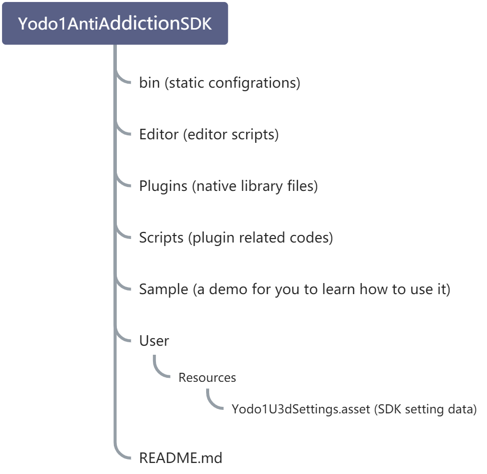

# Anti-addiction 2.0 integration manual

## ****Plug-in introduction****
At present, all of the developers who want to enter the China mobile market to release games have to abide by the relevant policies of the Chinese government on the protection of minors:

In order to protect the physical and mental health of minors, users under the age of 18 will be restricted by the anti-addiction system. When users become adults, the anti-addiction restriction strategy will be lifted (restriction strategies can be different in each specific game categories. Please be subject to the actual trigger in the game).

Therefore, we have made interfaces and plug-ins for the core requirements of the corresponding national policies, so that any user who uses the Yodo1 anti-addiction SDK can easily access the anti-addiction functions and passed the Chinese store review.

After the game is integrated with our SDK, be sure to implement the following core functions:

- Real name authentication
- Game play time limit
- Game payment limit


## ****Integration Guide****
We have made plug-in packages on various platforms for all kinds of developers:


- Unity Plugin
- Android Lib
- iOS Lib


---

### Unity Plugin
**Current version:**
<br />
0.9.2<br />

**Cocoapods version:**
<br />
2.0.2<br />


**Supports Unity 3D:**
- 2017.4.40c 
- 2018.4.27f1 
- 2019.4.12f1

and newer versions


**Download plugin:**
Copy this code below and paste into commandline to get the latest build (0.9.2)
```bash
curl -L "https://yodo1-generic.pkg.coding.net/anti-indulged-system-SDK/unity-plugin/Yodo1AntiIndulgedSDK?version=0.9.2" -o Yodo1AntiIndulgedSDK-0.9.2.unitypackage
```


#### Access instructions:
Plug-in structure

<br />
Download the Unity plug-in package and Import it to the current project :

Please apply for the application ID and key in MAS background, and you will get the unique AppKey of the application.
 
Enter the AppKey in the SDK configuration object (the AppKey of the application can be found in the background of the application).
 
Configuration object path Please reference plug-in structure diagram:
```
Yodo1AntiIndulgedSDK/User/Resources/Yodo1U3dSettings.asset
```


#### SDK initialization
After accessing the plug-in, call the relevant code in the function of object 'Awake' during project initialization:
```csharp
/// <summary>
/// Return initialization result callback(返回初始化结果回调).
/// </summary>
/// <param name="result">
///    <see value="true">Initialization successful(初始化成功).</see>
///    <see value="false">Initialization failed(初始化失败).</see>
/// </param>
/// <param name="content">Information content when initialization fails(初始化失败时的信息内容).</param>
public delegate void InitDelegate(bool result, string content);


private void Awake()
{
    // Set SDK initialization callback(设置sdk初始化回调).
	Yodo1U3dAntiIndulged.SetInitCallBack((bool result, string content) =>
    {
        if (result)
        {
            // Initialization successful(初始化成功).
            // TODO do the success flow and game begin.
        }
        else
        {
             // Initialization failed(初始化失败).
             // TODO do the fail flow, e.g. show the popup message to user. 
		}
		Debug.LogFormat("result = {0}, content = {1}", result, content);
    });
}
    
```


#### Real name authentication
When the game starts, a "enter the game" button should be set. After clicking, a real-name verification window will pop up. Users have to enter the citizen ID and relevant information of the People's Republic of China.
 
Users can enter the game and begin to experience the game content only after passing the verification.
```csharp
public void OnClickStartGameButton()
{
    // Certification authentication(实名认证).
    Yodo1U3dAntiIndulged.VerifyCertificationInfo(accountIdInputFiled.text, (Yodo1U3dEventAction eventAction) => {
        Debug.LogFormat("action = {0}", eventAction);
        bool isGuestUser = false;
        if (eventAction == Yodo1U3dEventAction.ResumeGame)
        {
            //Both successful real name authentication and Guest can continue to play(实名认证成功和游客都可以继续游戏).

            //Check whether it is a Guest(查询是否是试玩).
            isGuestUser = Yodo1U3dAntiIndulged.IsGuestUser();
            Debug.LogFormat("IsGuestUser = {0}", Yodo1U3dAntiIndulged.IsGuestUser());
        }
        else if(eventAction == Yodo1U3dEventAction.EndGame)
        {
            //Real name authentication failure prompt and exit the game(实名认证失败提示并退出游戏).
            Dialog.ShowMsgDialog("Warm prompt(温馨提示)", "Real name authentication failed(实名认证失败)!", true, () => {
                Application.Quit();
            });

        }
	});
}
```


#### Play time limit
Minor players will receive a warning after the total play time accumulates to a certain period of time. When the play time exceeds the limit, they will not be able to enter the game.
 
This function may require developers to modify certain game logic to implement corresponding scenarios. For example, a start screen with "enter the game" button should be added to the game, instead of directly entering the level after the game launched.


```csharp
/// <summary>
/// Callback triggered when the game is notified of the remaining time(对游戏进行剩余时间通知时触发的回调).
/// </summary>
/// <param name="eventAction"> 
///    <see value="ResumeGame">Continue game(继续游戏).</see>
///    <see value="ResumeGame">End game(结束游戏).</see>
/// </param> 
/// <param name="eventCode">
///    <see value="11001">Notification of playing time - minors(对于已玩时间的通知-未成年人).</see>
///    <see value="12001">Notice of no play period - minors(对于禁玩时段的通知-未成年人).</see>
///    <see value="11011">Notification of played time - visitors(对于已玩时间的通知-游客).</see>
///    <see value="12011">Notice of no play period - visitors(对于禁玩时段的通知-游客).</see>
///    <see value="50005">Events generated by third party channel SDK(第三方渠道SDK产生的事件).</see>
/// </param>
/// <param name="title">Notice title of game display(游戏展示的通知标题).</param>
/// <param name="content">Notice content of game display(游戏展示的通知内容).</param>
public delegate void TimeLimitNotifyDelegate(Yodo1U3dEventAction eventAction, int eventCode, string title, string content);


/// <summary>
/// Set remaining time notification callback(设置剩余时间通知回调).
/// </summary>
/// <param name="timeLimitNotifyCallBack">Remaining time notification callback(剩余时间通知回调).</param>
Yodo1U3dAntiIndulged.SetTimeLimitNotifyCallBack((Yodo1U3dEventAction action, string title, string content) =>
{
	Debug.LogFormat("action = {0}, title = {1}, content = {2}", action, title, content);
    if(action == Yodo1U3dEventAction.ResumeGame)
    {
        // Prompt when 10 minutes remain(剩余10分钟时提示).
        // TODO Warning user it's few time left for playing. 
    }
    else if (action == Yodo1U3dEventAction.EndGame)
    {
        // The game handles the pop-up prompt to exit the game(游戏处理退出游戏的弹框提示).
        // TODO Get time limit event, user can't play game util next day. 
        Dialog.ShowMsgDialog(title, content, true, ()=> {
            Application.Quit();
        });
    }
});
```


Game payment amount limit
Due to restrictions, minor users will not be able to continuously  purchase in-game items when the payment amount in the game reaches a certain limit.
 
In this case, developers need to determine whether the user has been restricted from payment before calling the payment interface.
 
At the same time, developers have to call the SDK's amount reporting interface to record the user's cumulative payment amount during each payment.


#### Check limits
```csharp
/// <summary>
/// Whether the callback of consumption has been restricted(是否已限制消费的回调).
/// </summary>
/// <param name="isAllow">
///    <see value="true">Available for purchase(可购买).</see>
///    <see value="false">Not available for purchase(不可购买).</see>
/// </param>
/// <param name="content">Notice content that needs to be displayed in the game when it is not available for purchase(不可购买时的需要游戏展示的通知内容).</param>
public delegate void VerifyPurchaseDelegate(bool isAllow, string content);

 //如果价格单位使用的分请使用分单位接口
/// <summary>
/// Verify consumption is restricted(验证是否已限制消费，分单位接口).
/// </summary>
/// <param name="priceCent">The price of the commodity, in cent(商品的价格，单位为分).</param>
/// <param name="currency">Corresponding currency symbol(对应货币符号，从产品信息里取).</param>
Yodo1U3dAntiIndulged.VerifyPurchase(priceCent, currency,  (bool isAllow, string context) => {
	Debug.LogFormat("hasLimit = {0}, context = {1}", isAllow, context);
    if (isAllow)
    {
        //Can buy, execute purchase process(可购买，执行购买流程).
        Purchase("com.yodo1.stampede.offer1", price, currency);
    }
    else
    {
        //Can't buy prompt player(不可以购买并提示玩家).
        Dialog.ShowMsgDialog("Warm prompt(温馨提示)", content);
    }
});

//如果价格单位使用的元请使用元单位接口
/// <summary>
/// Verify consumption is restricted(验证是否已限制消费，元单位接口).
/// </summary>
/// <param name="priceYuan">The price of the commodity, in yuan(商品的价格，单位为元).</param>
/// <param name="currency">Corresponding currency symbol(对应货币符号,商品信息里获得).</param>
public static void VerifyPurchaseYuan(priceYuan, currency,  (bool isAllow, string context) => {
	Debug.LogFormat("hasLimit = {0}, context = {1}", isAllow, context);
    if (isAllow)
    {
        //Can buy, execute purchase process(可购买，执行购买流程).
        Purchase("com.yodo1.stampede.offer1", price, currency);
    }
    else
    {
        //Can't buy prompt player(不可以购买并提示玩家).
        Dialog.ShowMsgDialog("Warm prompt(温馨提示)", content);
    }
})
```


#### Report consumption information
```csharp

/// <summary>
/// Submit the product info to SDK when game purchase has been success.(支付成功后将订单信息上报给SDK).
/// </summary>
void OnPurchaseSuccess(ProductInfo info)
{
    string productId = info.productId;  // com.yodo1.sample.item1
    //单位元价格
    double priceYuan = (double)info.price * 0.01;  // 6.99
    
    //单位分价格
    double priceCent = info.price;
    string currency = info.currency;   // CNY
    string orderId = info.orderId; // 1000000345744346
    // After purchase has been success.
    // It should pass the actual product information to the SDK to record the cumulative amount paid by users.
    //如果价格单位使用的分请使用分单位接口
    Yodo1U3dAntiIndulged.ReportProductReceipt(productId, Yodo1U3dProductType.Consumables, priceCent, currency, orderId);
    //如果价格单位使用的元请使用元单位接口
    Yodo1U3dAntiIndulged.ReportProductReceiptYuan(productId, Yodo1U3dProductType.Consumables, priceYuan, currency, orderId);
}

```

---

### Android Plugin
**Current version:**
2.0.7

#### Access description
If the game has been connected to the anti-addiction service of Yodo1SDK before, remove it first. Specifically, remove all codes that use the Yodo1ImpubicProtect interface class.
 
#### Project configuration
If your game does not need  access to any other Yodo1 SDK and  Yodo1 package service, you need to add the following tags to the AndroidManifest.xml of the game project:
```
<!-- name值固定不变，value的值随着需要发布的渠道变化(具体的值请联系运营人员) -->
<meta-data
	android:name="Yodo1ChannelCode"
	android:value="Yodo1"
	tools:replace="android:value" />
```


#### Anti-addiction SDK initialization (mandatory)

The game needs to initialize anti-addiction in ‘Activity onCreate’. Please note that initialization is asynchronous. Make sure to call other anti-addiction interfaces after the onInitFinish() callback method in Yodo1AntiIndulgedListener is triggered, otherwise, an exception occurs.
 
The Appkey used in the parameter is issued when the game is registered in the background of yodo1. Please contact the operator for details.
```
/*
	参数1：Activity的实体
  参数2：Yodo1下发的Appkey
  参数3：接收防沉迷系统回调的监听器
*/
Yodo1AntiIndulged.init(activity, appkey, new Yodo1AntiIndulgedListener() {
				/**
         * 初始化完成后会触发该回调方法，游戏需要等到该方法返回成功后再操作其他的防沉迷接口
         * @param result 是否成功
         * @param message 错误信息
         */
        @Override
        public void onInitFinish(boolean result, String message) {
            YLog.i(TAG + "onInitFinish, result = " + result + ", message = " + message);
            isInit = result;
        }

        /**
         * 当玩家剩余时间不足时，通过该回调给到游戏通知。
         * @param event   通知实体
         * @param title   需要游戏展示的通知标题
         * @param content 需要游戏展示的通知内容
         */
        @Override
        public void onTimeLimitNotify(Yodo1AntiIndulgedEvent event, String title, String content) {
            YLog.i(TAG + "onTimeLimitNotify, eventCode = " + event.getEventCode() + ", action = " + event.getAction().toString() + ", title = " + title + ", content = " + content);
            Toast.makeText(MainActivity.this, content, Toast.LENGTH_LONG).show();
            // 当action的值为EndGame时，需要结束游戏。否则为ResumeGame时，只给玩家即将到时的提醒，然后游戏继续即可。
            if (event.getAction() == Yodo1AntiIndulgedEvent.EventAction.EndGame) {
                YLog.e(TAG + "onTimeLimitNotify, 游戏结束");
            } else {
                YLog.i(TAG + "onTimeLimitNotify, 只提醒玩家即将到时，游戏继续运行");
            }
        }
    });
```


#### Real name authentication (mandatory)
After the player logs in, the game needs to call the real-name verification interface to ensure that the player passes the real-name verification before entering the game.
 
The accountID used in the real-name verification interface is generated by the game itself. You can also access the account system of Yodo1SDK and use the account returned after you log on to yodo1.
If the game does not have the account function, you can also use the device number as a temporary replacement.
 
Players must have a network connection before they can pass the real-name verification. Without network connection, players can only play for a short time through the trial entrance.
```
/*
	参数1：当前运行的Activity
  参数2：游戏产生或第三方账号系统产生的账号ID，如果游戏没有账号体系，可传入设备号替代。
*/
Yodo1AntiIndulged.verifyCertificationInfo(activity, accountId, new Yodo1CertificationCallback() {
        @Override
        public void onResult(Yodo1AntiIndulgedEvent.EventAction action) {
        YLog.i(TAG + "verifyCertificationInfo callback, action = " + action.name());
        if (action == Yodo1AntiIndulgedEvent.EventAction.EndGame) {
        isCertification = false;
        MainActivity.this.finish();
        } else {
        isCertification = true;
        Toast.makeText(MainActivity.this, "实名完毕，继续游戏。", Toast.LENGTH_LONG).show();
        }
        changeView();
        }
		});
```


#### Play time limit (mandatory)

After a player passes real-name verification and is authenticated as a minor (or enters the game through the trial button),Yodo1 anti-addiction system will limit the player's play time.
This function is automatically run by Yodo1 anti-addiction SDK, and no additional access is required.
The developer only needs to pay attention to the onTimeLimitNotify callback method in the Yodo1AntiIndulgedListener listener passed in during initialization. The SDK uses this method to inform the developer what to do.
This method is described as follows:
```
/**
  * 对游戏进行剩余时间通知时触发的函数
  *
  * 当游戏收到回调后，需要弹出对话框来告知玩家（对话框的展示内容请使用回调返回的title及content），
  * 并在玩家确认完对话框内容后通过getAction()的值来进行后续的动作（结束或继续游戏）
  *
  * @param event   通知实体
  * @param title   需要游戏展示的通知标题
  * @param content 需要游戏展示的通知内容
  */
void onTimeLimitNotify(Yodo1AntiIndulgedEvent event, String title, String content);

class Yodo1AntiIndulgedEvent {
    // 收到通知后，接入者通过getAction()来判断需要进行的动作，ResumeGame为可以继续游戏，EndGame为结束游戏
    EventAction getAction();
    // (选择使用)接入者可以通过getEventCode()来判断出当前通知是由什么事件触发的，参数值见下方
    int getEventCode();
}

public static class EventCode {
    /**
    * 玩家为未成年人时，即将或已经到达今日时长的通知
    */
    public static final int EVENT_NOTIFY_MINOR_PLAYED_TIME = 11001;
    /**
    * 玩家为未成年人时，即将或已经到达禁玩时段的通知
    */
    public static final int EVENT_NOTIFY_MINOR_FORBIDDEN_TIME = 12001;
    /**
    * 试玩模式下，即将或已经到达今日时长的通知
    */
    public static final int EVENT_NOTIFY_GUEST_PLAYED_TIME = 11011;
    /**
    * 试玩模式下，即将或已经到达禁玩时段的通知
    */
    public static final int EVENT_NOTIFY_GUEST_FORBIDDEN_TIME = 12011;
    /**
    * 第三方渠道SDK产生的事件
    */
    public static final int EVENT_NOTIFY_THIRD_CHANNEL_UNKNOW_EVENT = 50005;
}
```


#### Payment amount restrictions and Reporting (mandatory)

When a player makes a purchase, the developer needs to call the payment interface to determine whether the player has reached the upper limit of the payment amount.
```
/*
	参数1: 玩家要购买的商品价格，单位为分
  参数2: 货币符号，设置为"CNY"
*/
Yodo1AntiIndulged.verifyPurchase(price, currency, new Yodo1VerifyPurchaseCallback() {
        @Override
        public void onResult(boolean isAllow, String message) {
        YLog.d(TAG + "purchase , isAllow = " + isAllow + ", message = " + message);
        if (isAllow) {
        		// 允许购买，继续进行购买操作
        }
});
```
Finally, after the purchase is successful and the product has been distributed to the player, developer needs to call the reporting interface to notify the SDK to record the player's expenses this time:
```
/*
	orderId: 订单号。如果接入Yodo1支付系统则由支付回调返回，否则由游戏自己产生。
  itemCode: 商品编号
  itemType: 商品类型，见下方
  price: 商品价格，单位为分
  
*/
Yodo1ProductReceipt receipt = new Yodo1ProductReceipt(
				orderId,
       	itemCode,
        itemType,
        price,
        currency);
Yodo1AntiIndulged.reportProductReceipt(receipt);


public enum ItemType {
				NonConsumables("非消耗品", 0),
        Consumables("消耗品", 1), 
        AutoSubscription("订阅商品", 2);
}	
```


---

### iOS Plugin
 
#### Access description
If the game has been connected to the anti-addiction service of Yodo1SDK before, remove it first. Specifically, remove all code that uses the Yodo1RealNameManager interface class.


#### Project configuration
Anti-addiction 2.0 is integrated with cocoapods. The version is 2.0.0.1. The profile example is as follows:
```
platform :ios, '9.0'
source 'https://github.com/Yodo1Sdk/Yodo1Spec.git'
source 'https://github.com/CocoaPods/Specs.git'
target 'yodo1-anti-indulged-ios' do
    pod 'Yodo1AntiIndulged', '2.0.0.1'
end

```


#### Anti-addiction SDK initialization (mandatory)

The game needs to be in Perform anti-addiction initialization in the didFinishLaunchingWithOptions method. Note that initialization is asynchronous. Wait until the onInitFinish callback method in Yodo1AntiIndulgedDelegate is triggered before calling other anti-addiction interfaces. Otherwise, an exception will occur.
 
The Appkey used in the parameter is issued when the game is registered in the background of yodo1. Please contact the operator for details.
```
/*
  参数1：Yodo1下发的Appkey
  参数2：接收防沉迷系统回调的delegate
*/
- (void)init:(NSString *)appKey delegate: (id<Yodo1AntiIndulgedDelegate>)delegate;

#pragma mark - Yodo1AntiIndulgedDelegate
- (void)onInitFinish:(BOOL)result message:(NSString *)message {
}

- (BOOL)onTimeLimitNotify:(Yodo1AntiIndulgedEvent *)event title:(NSString *)title message:(NSString *)message {
    NSLog(@"游戏通知 - %@", message);
    return NO;
}
```


#### Real name verification (mandatory)
After the player logs in, the game needs to call the real-name verification interface to ensure that the player passes the real-name verification before entering the game.
The accountID used in the real-name verification interface is generated by the game itself. You can also access the account system of Yodo1SDK and use the account returned after you log on to yodo1.
If the game does not have the account function, you can also enter the device number as a temporary replacement.
Players must have a network connection before they can pass the real-name verification. Without network connection, players can only play for a short time through the trial entrance.
```
/// 验证玩家实名信息
/// accountId 玩家账号
/// success 实名认证成功回调
/// failure 实名认证失败回调
- (void)verifyCertificationInfo:(NSString *)accountId success:(Yodo1AntiIndulgedSuccessful)success failure:(Yodo1AntiIndulgedFailure)failure;

#pragma mark - Yodo1AntiIndulgedSuccessful
typedef BOOL (^Yodo1AntiIndulgedSuccessful)(id _Nullable);

#pragma mark - Yodo1AntiIndulgedFailure
typedef BOOL (^Yodo1AntiIndulgedFailure)(NSError * _Nonnull);
```


#### Play time limit (mandatory)
After a player passes real-name verification and is authenticated as a minor (or enters the game through the trial button),Yodo1 anti-addiction system will limit the player's play time.
This function is automatically run by Yodo1 anti-addiction SDK, and no additional access is required.
The developer only needs to pay attention to the onTimeLimitNotify callback method in the Yodo1AntiIndulgedDelegate agent passed in during initialization. The SDK uses this method to inform the developer what to do.
This method is described as follows:
```
/// 验证玩家实名信息
/// 当游戏收到回调后，需要弹出对话框来告知玩家（对话框的展示内容请使用回调返回的title及message），并在玩家确认完对话框内容后通过event.action的值来进行后续的动作（结束或继续游戏）
/// event   通知实体
/// title   需要游戏展示的通知标题
/// content 需要游戏展示的通知内容
- (BOOL)onTimeLimitNotify:(Yodo1AntiIndulgedEvent *)event title:(NSString *)title message:(NSString *)message;

#pragma mark - Yodo1AntiIndulgedEvent
@interface Yodo1AntiIndulgedEvent : NSObject
@property (nonatomic, assign) Yodo1AntiIndulgedEventCode eventCode;
@property (nonatomic, assign) Yodo1AntiIndulgedAction action;
@property (nonatomic, copy) NSString *title;
@property (nonatomic, copy) NSString *content;
@end

#pragma mark - Yodo1AntiIndulgedAction
typedef enum: NSInteger {
    Yodo1AntiIndulgedActionResumeGame = 0,
    Yodo1AntiIndulgedActionEndGame = 1
} Yodo1AntiIndulgedAction;

#pragma mark - Yodo1AntiIndulgedEventCode
typedef enum: NSInteger {
    Yodo1AntiIndulgedEventCodeNone = 0,
    /**
     * 对于已玩时间的通知-未成年人
     */
    Yodo1AntiIndulgedEventCodeMinorPlayedTime = 11001,
    /**
     * 对于禁玩时段的通知-未成年人
     */
    Yodo1AntiIndulgedEventCodeMinorForbiddenTime = 12001,
    /**
     * 对于已玩时间的通知-游客
     */
    Yodo1AntiIndulgedEventCodeGuestPlayedTime = 11011,
    /**
     * 对于禁玩时段的通知-游客
     */
    Yodo1AntiIndulgedEventCodeGuestForbiddenTime = 12011
} Yodo1AntiIndulgedEventCode;
```


#### Payment amount restrictions and Reporting (mandatory)
When a player makes a purchase, the user needs to call the payment interface to determine whether the player has reached the upper limit of the payment amount.
```
/// 验证玩家是否已被限制消费
/// money: 玩家要购买的商品价格，单位为分
/// success 消费验证成功回调
/// failure 消费验证失败回调
- (void)verifyPurchase:(NSInteger)money success:(Yodo1AntiIndulgedSuccessful)success failure:(Yodo1AntiIndulgedFailure)failure;
```
Finally, after the game is purchased successfully and the product has been distributed to the player, the developer needs to call the reporting interface to notify the SDK to record the player's expenses this time:
```
/// 上报消费信息
/// receipt 小票及商品信息组
/// success 消费上报成功回调
/// failure 消费上报失败回调
- (void)reportProductReceipt:(Yodo1AntiIndulgedProductReceipt *)receipt success:(Yodo1AntiIndulgedSuccessful)success failure:(Yodo1AntiIndulgedFailure)failure;

//小票及商品信息组
@interface Yodo1AntiIndulgedProductReceipt : NSObject
@property (nonatomic, retain) NSString *orderId; // 订单编号
@property (nonatomic, retain) NSString *itemCode; // 商品编号
@property (nonatomic, assign) Yodo1AntiIndulgedProductType itemType; // 商品类型
@property (nonatomic, assign) NSInteger money; // 金额 单位分
@property (nonatomic, retain) NSString *region; // 区
@property (nonatomic, retain) NSString *spendDate; // 消费时间
@property (nonatomic, retain) NSString *currency; // 币种（大写） ,示例值(CNY)
@end
```


